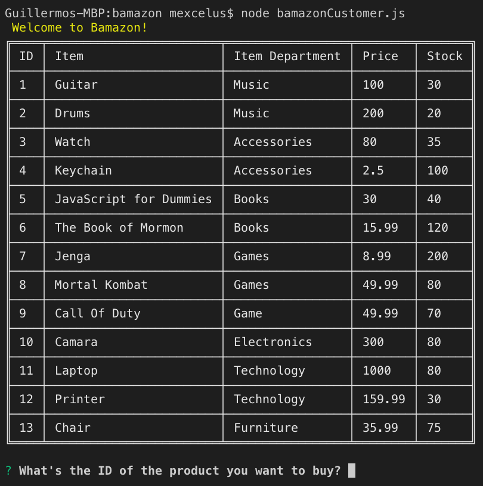
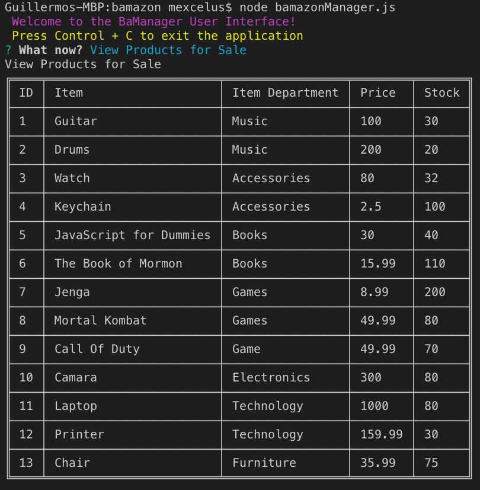
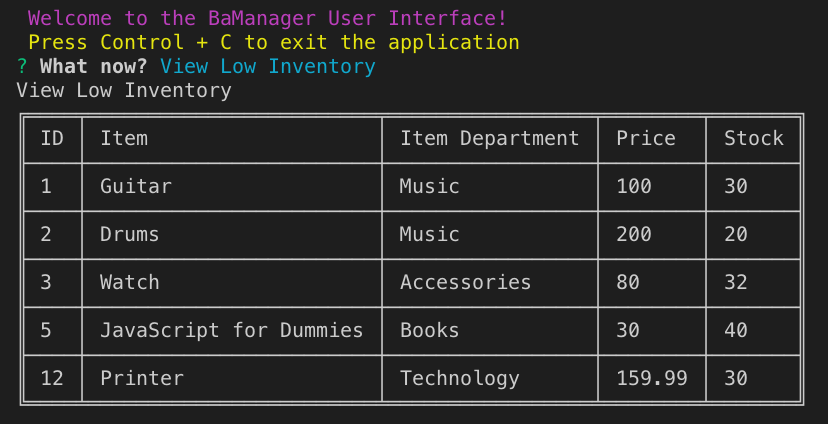
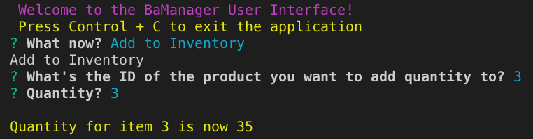
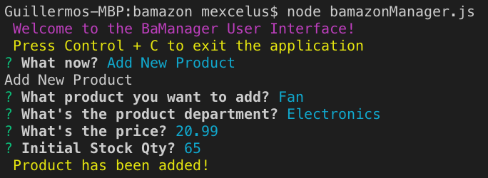

# bamazon

Amazon-like storefront living in MySQL. The app takes orders from customers and depletes stock from the store's inventory.

## Value Proposition :dart:
  
Storefront running on `node.js`! This application allows you to provide a interface for customers to buy on and branch managers to handle inventory on (Inventory Worksheet). Customers are able to browse through a list of items for something they need or want. On the Manager side, four functions are present:
- A view of items for sale.
- A view of items that are low on inventory.
- Add to inventory for a specific item feature
- Add new item to list feature
  
## Instructions :memo:  
  
- Start by running either `node bamazonCustomer` for customers or `node bamazonManager` for managers.
- Props will appear guiding users inside the UI.
  
## Code Overview :deciduous_tree:

The most import piece of code on this repository resides on the `bamazonManager.js` file. A switch statement which handles all four features inside the program:
  
```javascript
    switch (res.choice) {
        case "View Products for Sale":
            return productsForSale();
        case "View Low Inventory":
            return viewLowInv();
        case "Add to Inventory":
            return addToInv();
        case "Add New Product":
            return addNewProduct();
```  

Along side the `mysql` npm package to handle the conneciton to the DB that holds the data, the `inquirer` package which asks for user input and the `table` npm package modeling the tables inside the terminal.
  
## Prerequisites :computer:
Working web browser (e.g Chrome, Firefox, Safari, Opera, etc.) from the list of browser that support jQuery (https://jquery.com/browser-support/):

* Desktop:
  * Chrome: (Current - 1) and Current
  * Edge: (Current - 1) and Current
  * Firefox: (Current - 1) and Current, ESR
  * Internet Explorer: 9+
  * Safari: (Current - 1) and Current
  * Opera: Current

* Mobile
  * Stock browser on Android 4.0+
  * Safari on iOS 7+

  You'll also need to install `inquirer` package, `mysql` package, `table` package and `node` on your client by running the following on your terminal:
  ```bash
  npm i inquirer
  npm i mysql
  npm i table
  brew install node
  ```

## Example Images :camera:

**Bamazon Customer UI**



**Bamazon Manager UI**




